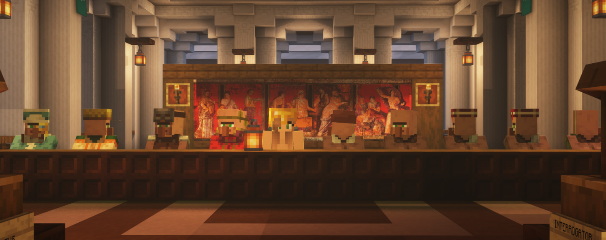

+++
title = "I. Creación de Personajes"
weight = 1
+++

 

El primer paso para poder jugar a BRUNDISIUM es imaginar y crear a tu propio personaje. Dicho personaje debe ser una combinación de números, ganchos de interpretación y tu imaginación. En primer lugar, escoge una cultura (brundisio, egineta, jadeíta, etc.) y, dentro de esta, una subcultura, una clase social y un tipo de personaje. También deberás inventar una personalidad, apariencia e historia pasada de tu personaje. Una vez esté terminado, este será tu representante en el mundo de BRUNDISIUM.
 

 

